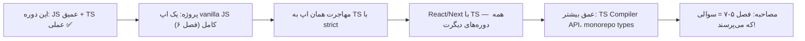

# فصل ۱۳ — چیت‌شیت دوتایی، گلاساری و نقشه راه

> 🎯 **هدف:** مرجع مرور سریع دو زبان — JS در یک صفحه، TS در یک صفحه — به‌علاوه گلاساری و نقشه راه.

---

## ۱۳.۱ — چیت‌شیت JavaScript

```js
// ═══ متغیرها ═══
const x = 1;            // پیش‌فرض
let y = 2;              // قابل تغییر
// var هرگز

// ═══ عملگرها ═══
=== !==                 // همیشه
??                      // nullish (نه ||)
% **                    // باقیمانده / توان
"5" + 3 // "53" ⚠️

// ═══ شرط و حلقه ═══
if (...) {} else if {} else {}
cond ? a : b
for (let i = 0; i < n; i++)
for (const item of items)
while (cond)
break / continue

// ═══ توابع ═══
function f(a, b = 0) { return a + b }
const f = (a) => a * 2;         // return ضمنی
function f(...args) {}          // rest

// ═══ closure ═══
function make() { let n = 0; return () => ++n; }

// ═══ آبجکت/آرایه ═══
const { a, b = 0 } = obj;       // destructuring
const [x, ...rest] = arr;
const copy = { ...obj, k: v };  // shallow!
arr.at(-1) .push() .includes()
Object.keys(obj) / entries(obj)

// ═══ آرایه متدها ═══
.map(fn)      // تبدیل
.filter(fn)   // حذف
.find(fn)     // اولین
.reduce((acc, x) => ..., init)  // تاخوردن
.some(fn) / every(fn)
sort((a,b) => a - b)
groupBy: reduce + (acc[k] ??= []).push(x)

// ═══ رشته ═══
s.trim() .split(",") .join(" ") .replaceAll("a","b") .includes() .at(-1)
`${x + 1}`                      // template literal

// ═══ اعداد و Intl ═══
Number("42") parseInt parseFloat
Number.isNaN(x)
new Intl.NumberFormat("fa-IR").format(n)

// ═══ Async ═══
async function f() {
  try {
    const res = await fetch(url);
    if (!res.ok) throw new Error(res.status);
    return await res.json();
  } catch (e) { ... } finally { ... }
}
await Promise.all([a, b])       // موازی!
// event loop: sync → microtask → macrotask

// ═══ ماژول ═══
export default fn; export const x = 1;
import fn, { x } from "./mod.js";

// ═══ DOM ═══
document.querySelector("#id")
el.textContent = "..."           // امن
el.classList.toggle("c")
el.addEventListener("click", fn)
e.preventDefault()               // در submit
```

## ۱۳.۲ — چیت‌شیت TypeScript

```ts
// ═══ پایه ═══
let s: string = "x";
let ids: number[] = [1, 2];
let pair: [string, number] = ["a", 1];
let id: string | number;                  // union
let dir: "up" | "down";                   // literal
function f(a: string, b = 0): string {...}
// any ✗ / unknown + narrowing ✓

// ═══ interface / type ═══
interface User { id: number; email?: string; readonly createdAt: Date }
type ID = string | number;
type Staff = Person & Employee;           // intersection
interface Staff extends Person {}

// ═══ narrowing ═══
typeof x === "string" / Array.isArray / instanceof
if (res.ok) { res.data }                  // discriminated union + switch
function isCat(a: Cat | Dog): a is Cat { return "meow" in a }

// ═══ generics ═══
function first<T>(arr: T[]): T | undefined
interface ApiResponse<T> { data: T }
function pluck<T, K extends keyof T>(o: T, k: K): T[K]

// ═══ utility types ═══
Partial<T>          // همه اختیاری (آپدیت)
Pick<T, "a" | "b">  // فقط بعضی
Omit<T, "id">       // حذف بعضی
Record<string, T>   // دیکشنری
Readonly<T> / Required<T>
ReturnType<typeof fn> / Parameters<typeof fn>[0]

// ═══ ترفندها ═══
const colors = ["red","green"] as const;
type Color = (typeof colors)[number];
type UserEmail = User["email"];
{ ... } satisfies Record<K, V>;           // چک + حفظ دقت
as HTMLInputElement                       // assertion — کم و آگاهانه

// ═══ zod ═══
const Schema = z.object({ name: z.string().min(1) });
type Data = z.infer<typeof Schema>;       // تایپ از اسکیما
Schema.safeParse(input);                  // runtime validation
```

## ۱۳.۳ — گلاساری فارسی–انگلیسی

| انگلیسی | فارسی | یک جمله |
|---|---|---|
| Variable | متغیر | جعبه‌ای با اسم برای مقدار |
| Scope | دامنه دید | متغیر کجا زندگی می‌کند |
| Hoisting | بالا آمدن | تعریف‌ها قبل اجرا بالا می‌آیند |
| Closure | بستار | تابع + حافظه‌ی محیط تولدش |
| Callback | تابع برگشت‌خوانی | تابعی که به تابع دیگر داده می‌شود |
| Promise | وعده | رسید نتیجه‌ی عملیات آینده |
| async/await | — | نوشتن async به شکل خوانا |
| Event Loop | حلقه رویداد | چرخه اجرای sync/microtask/macrotask |
| Destructuring | باز‌کردن ساختار | استخراج تمیز فیلد/عنصر |
| Spread/Rest | پخش/جمع `...` | باز کردن / جمع کردن |
| Shallow copy | کپی سطحی | سطح اول کپی؛ تو در تو مرجع مشترک |
| Immutable | تغییرناپذیر | به‌جای تغییر، نسخه جدید |
| Type Inference | استنتاج نوع | TS خودش نوع را حدس می‌زند |
| Union | اجتماع نوع | `string \| number` |
| Narrowing | تنگ‌کردن نوع | با چک، نوع دقیق‌تر می‌شود |
| Generic | نوع عمومی/پارامتری | `function first<T>` |
| Type Guard | نگهبان نوع | تابعی که نوع را تضمین می‌کند (`is`) |
| Utility Type | تایپ کمکی | Partial/Pick/Omit... |
| strict mode | حالت سخت‌گیر | قوانین کامل TS روشن |
| Zod | — | اعتبارسنجی runtime + تایپ با infer |

## ۱۳.۴ — نقشه راه پس از این دوره



**سه توصیه پایانی:**

1. **TS را با سخت‌گیری یاد بگیر، نه با فرار:** `any` و `as` وسوسه‌انگیزند — هر بار که استفاده کردی بپرس «راه درستش چی بود؟» — همین تمرین، تو را senior می‌کند.
2. **JS عمیق = TS سریع:** closure، event loop و متدهای آرایه را که واقعاً فهمیده باشی، TS برایت فقط قوانین است، نه درس جدید.
3. **داکیومنت رسمی دوست توست:** [developer.mozilla.org (MDN)](https://developer.mozilla.org) برای JS (بهترین مرجع دنیا — حتی فارسی‌سازی دارد) و [typescriptlang.org/docs](https://www.typescriptlang.org/docs/handbook/) — هر دویی که این دوره کوتاهش کرده.

**پایان دوره:** تو از «متغیر یعنی چی؟» به «generic با constraint و utility type» رسیدی — و حالا در هر پروژه‌ای، هر زبانی از این دو، راحت کد می‌زنی. قدم بعدی در کتابخانه‌ات: دوره ۶ (React/Next) را با چشم TS دوباره بخوان — همه‌چیز عمیق‌تر دیده می‌شود! 🟨🔷🚀
